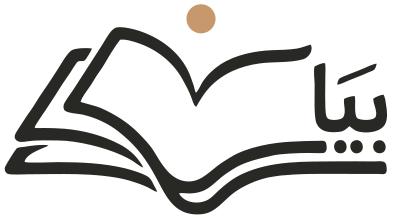

# Bayan (بيان) — Design System

**Bayan (بيان) — An AI Reading Assistant for Arabic Readers with Dyslexia.**
Bayan helps Arabic readers with dyslexia (عُسر القراءة) read with less effort. It reads text aloud, highlights each word as it is spoken, adjusts size, spacing and diacritics (tashkeel), and focuses one line at a time. Every foundation here is tuned for that reader first: legibility, calm, and control.

**How it works (the real product):** an on-device Android app. Its main entry is the system text-selection menu: select Arabic text in any app, tap «تبسيط», and a bottom sheet opens over that app. The sheet shows the simplified text, with read-aloud and word highlighting, a tashkeel on/off toggle, and a switch to the original. There are no accounts and no cloud. The ~220 MB model downloads once on first run (Wi‑Fi-only option), then everything runs offline. The app itself has only:
- **Onboarding** (first run): welcome → model download → how to use the selection menu
- **Home**: model status, a paste-text box, how-to steps
- **Reading settings**: font, size, line spacing, tashkeel default

Sources: the user-supplied logo images (stacked light/dark, horizontal light/dark, in `uploads/`) and the product title above. No codebase, Figma, screens or copy were provided. Type, extended palette and components are derived from the mark and the audience, and should be confirmed.

## The mark
The Arabic wordmark **بيان** ("clarity / eloquent statement") drawn in a monoline pen. The open book forms the upper strokes and its central fold reads as the bowl of the **ن**; the ochre sun sits where the ن's dot would be. Ink on warm paper, one warm accent.

Sampled values: paper `#F6F2E6`, ink `#282824`, night `#1A1A14`, cream `#F2EFE2`, sun `#C6986B`.

### Logo files (`assets/logo/`) — v2
Four lockups, each in six colorways. SVG is the master; PNGs at 2048px and 512px wide live in `assets/logo/png/`.
- **stacked** — book + بيان, centered (primary)
- **horizontal** — book + بيان + "Bayan" (bilingual). Latin is Readex Pro, outlined; cap height = alif height; shares the Arabic baseline
- **mark** — horizontal book + بيان, no Latin (headers, compact spaces)
- **symbol** — book + sun only (app icons, favicons, avatars, watermarks)

Colorways: `-light`, `-dark`, `-light-bg`, `-dark-bg`, `-mono-ink`, `-mono-cream`. Example: `assets/logo/bayan-horizontal-dark.svg`.

Icons (`assets/icons/`): `app-icon-light|dark` (SVG + 1024/512/192/180 PNG) and `favicon-light|dark` (SVG + 48/32/16 PNG), all built on the symbol.

**v2 refinements.** The v1 traces were faceted polylines (~350 nodes). v2 re-traces the rasters and fits least-squares cubic Béziers with corner detection, which gives ~130 nodes, smooth curves, 60% smaller files, and a true-circle sun. The Latin in the horizontal lockup is re-set in the system typeface and aligned to the Arabic. v1 files are kept in `assets/logo/v1/`. Source geometry: `assets/logo/_src/geometry-v2.json`. Tracer: `tools/trace-lib.js`.

Clear space = sun diameter on all sides. Minimum size: stacked 40px tall, horizontal 24px tall, symbol 16px.

## Dark mode
Taken from the dark logo: night ground, cream stroke, same ochre sun. Set `<html data-theme="dark">`. The theme swaps the paper and ink scales, so all components invert with no code changes: in dark mode `--paper-*` is the night ground scale and `--ink-*` is the cream foreground scale. Ochre-700 (accent text) and semantic colors lift for contrast. Shadows deepen and the scrim darkens to 60% black.

## Banners
`Bayan Banners.dc.html` holds 1500×500 banner directions: turn 3 (product messaging), turn 2 (logo v2), turn 1 (as briefed + first suggestions).

## Developer quick start
```html
<html lang="ar" dir="rtl" data-theme="light"><!-- or "dark" -->
<head>
  <link rel="stylesheet" href="styles.css"><!-- tokens + Google Fonts + base -->
  <link rel="icon" href="assets/icons/favicon-light.svg" type="image/svg+xml">
  <link rel="icon" href="assets/icons/favicon-light-32.png" sizes="32x32">
  <link rel="apple-touch-icon" href="assets/icons/app-icon-light-180.png">
  <meta name="theme-color" content="#F6F2E6" media="(prefers-color-scheme: light)">
  <meta name="theme-color" content="#1A1A14" media="(prefers-color-scheme: dark)">
</head>
<body>
  
</body>
```
- Use semantic aliases (`--surface-page`, `--text-primary`, `--accent`, `--border-default`) in product code, and base scales only when no alias fits.
- Components in `components/**` are React 18, dependency-free, styled with CSS variables. Each has a `.d.ts` contract and a `.prompt.md` usage note.
- Use the `-dark` logo files when `data-theme="dark"`.

## ACCESSIBILITY (dyslexia-first rules)
- **Typeface**: Readex Pro everywhere, including reading text. It is the Arabic expansion of Lexend, designed with Nadine Chahine using Lexend's reading-fluency method (widened letter shapes and spacing). Noto Naskh Arabic is offered as a reader-setting alternative, never forced.
- **Size floors**: UI body 18px, nothing below 14px. Reader text defaults to 24px (`--read-m`) with S 20 / L 28 / XL 34.
- **Spacing**: reader leading 2.1 (2.5 with tashkeel), word spacing +0.18em (`--read-word-space`), paragraph gap 1.2em, line length ≤ 34em.
- **Never** justify Arabic text (kashida stretching distorts word shapes), letter-space Arabic (breaks joining), use italics, or set body text in all-bold.
- **Ground**: cream paper, never pure white; ink, never pure black. The same applies in dark mode (night `#1A1A14`, cream `#F2EFE2`).
- **Contrast**: text ≥ 4.5:1 on its ground; ochre text only as `--ochre-700`.
- **Read-aloud highlight**: current word gets a `--read-highlight` band with 6px radius. Words already read fade to `--read-spoken`. Use no underline, and don't change weight, because that reflows the line.
- **Line focus**: active line on a `--read-line-focus` band, other lines at 32% opacity, optional 2px ochre ruler.
- **Syllable split**: alternate `--read-syllable-a/b` colours only. Never insert spaces or break letter joins.
- **Targets**: 44px minimum (Button md, IconButton md). Every icon-only control has a text label/tooltip.
- **Motion**: honour `prefers-reduced-motion`; highlight moves by colour, not by animation.
- **Audio first-class**: every screen with text offers "استمع" (listen).

## CONTENT FUNDAMENTALS
- Arabic-first, RTL. Modern Standard Arabic, **plain and short**: one idea per sentence, common words, ≤ 12 words per UI sentence.
- Warm and encouraging; never clinical or pitying. Speak about reading, not about deficits. Avoid "مشكلة", "ضعف", "علاج" (problem, weakness, treatment). Prefer "بطريقتك", "على راحتك" (your way, at your pace).
- Person-first when dyslexia must be named: "القرّاء ذوو عسر القراءة" (readers with dyslexia), not "المعسورون".
- Never grade or shame: no red "wrong" states on reading; progress is shown as time read or pages, never errors.
- Add tashkeel to short UI words that are easily misread, e.g. "اِسْتَمِعْ".
- Address the reader as أنت: "ابدأ القراءة", "مكتبتك", "إعداداتك". The brand speaks as نحن sparingly.
- Short imperatives on actions: "استمع", "اقرأ معي", "كبّر الخط", "تراجع".
- Sentence case for Latin; Latin all-caps only for tiny eyebrows with 0.08em tracking.
- Arabic-Indic numerals (٠١٢٣) in Arabic copy; Western numerals in Latin copy. «» guillemets for quotes.
- No emoji. No exclamation stacks.

## VISUAL FOUNDATIONS
- **Color**: paper neutrals (`--paper-0…4`) and warm ink (`--ink-1…4`) carry ~95% of any screen. Ochre (`--ochre-500`) is the sun: one ochre moment per view (a radio dot, an accent CTA, a highlight). Ochre text uses `--ochre-700` for contrast. Semantic colors are earthy: olive, brick, slate.
- **Type**: Readex Pro for display, UI and reading (Arabic & Latin); its even monoline stroke echoes the logo pen. See ACCESSIBILITY for reader tokens. IBM Plex Mono only for codes. Headings at weight 500.
- **Spacing**: 4px base; generous margins; reading column `--read-measure` (34em).
- **Backgrounds**: flat warm paper. No gradients, no photos behind text, no patterns. Imagery (covers, portraits) sits in its own frame.
- **Imagery vibe**: warm, matte, slightly desaturated; paper and daylight. No cool casts.
- **Borders over shadows**: cards are outlined 1px `--paper-4` on `--paper-0`. Outlined controls use 1.5px ink ("pen" weight). Active tab = 2px ink underline.
- **Shadows**: warm-tinted, low. `--shadow-2` for floating menus, `--shadow-3` only for dialogs/toasts.
- **Radii**: 4 checkbox · 6 tooltip · 10 buttons/fields · 16 cards · 24 dialogs · pill for tags, badges, icon buttons, switch.
- **Hover**: filled buttons lighten one step (ink-1 → ink-2); transparent controls gain `--paper-2`. Interactive cards lift 2px and their border turns ink.
- **Press**: 1px downward nudge (buttons) or scale .94 (icon buttons).
- **Focus**: ink border + 3px ochre ring (`--ring`).
- **Motion**: quiet, page-turn feel. `--ease-page` cubic-bezier(.32,.72,.24,1); 120/200/360ms. Fades and short slides; no bounce.
- **Transparency/blur**: only the dialog scrim (ink at 36%). No glass effects.
- **Layout**: RTL by default; use logical properties (inset-inline-start, padding-inline).

## APP PROTOTYPE
`Bayan App.dc.html` is the interactive Android prototype of all screens above, including a mock host app with the selection toolbar. Tweaks: `theme` (light/dark), `startScreen`. Read-aloud is simulated with a timed word highlight. In production, drive `idx` from the on-device TTS word-boundary callbacks (`UtteranceProgressListener.onRangeStart`).

Sheet anatomy, top to bottom:
- grabber
- header: symbol + "بيان · على جهازك · دون إنترنت" + close
- المبسّط / الأصلي segmented control
- reading text (reader tokens from Settings)
- footer: التشكيل toggle chip, copy, then the player (56px play, progress, speed chip ١× / ١٫٢٥× / ٠٫٧٥×)

The sheet is 82% of the screen height, with a 28px top radius and `--shadow-3` over `--scrim`.

## ICONOGRAPHY
- No icon set was provided. **Substitution: Lucide** from CDN (`https://unpkg.com/lucide@0.460.0/dist/umd/lucide.min.js`), monoline with round caps, closest to the logo pen. Stroke-width 1.75, 18–20px, `currentColor`.
- In HTML/DC mocks, colour icons with a CSS mask so they follow theme tokens: `background:var(--ink-1); mask:url(https://unpkg.com/lucide-static@0.460.0/icons/NAME.svg) center/contain no-repeat` (plus `-webkit-mask`). On Android, import the same Lucide icons as vector drawables.
- Mirror directional icons (arrows, chevrons) in RTL.
- No emoji; no unicode glyphs as icons (except × for dismiss).
- Never redraw the book-and-sun mark as an icon; use the logo PNG.

## Index
- `styles.css` — entry point (imports only)
- `tokens/` — fonts, colors (light + `[data-theme="dark"]`), typography, spacing (spacing, radii, strokes, shadows, motion), base
- `tokens/tokens.json` — the same values as JSON for native/Tailwind/Figma pipelines
- `guidelines/` — specimen cards (Colors, Type, Reading, Spacing, Brand, Dark mode)
- `assets/logo/` — 4 lockups × 6 colorways, SVG + PNG (v1 archive in `v1/`)
- `assets/icons/` — app icons + favicons
- `tools/trace-lib.js` — raster→Bézier tracer used to build the logos
- `Bayan Banners.dc.html` — banner directions (chosen: 3c, tagline «اقرأ بوضوح»)
- `Bayan App.dc.html` — interactive Android prototype (onboarding, home, host app + sheet, reading settings)
- `android-frame.jsx` — device frame used by the prototype
- `components/core/` — Button, IconButton, Badge, Tag, Card
- `components/forms/` — Input, Select, Checkbox, Radio, Switch
- `components/navigation/` — Tabs
- `components/feedback/` — Dialog, Toast, Tooltip
- `SKILL.md` — agent skill wrapper

The app prototype was designed from the product description, since no real screens were supplied. The component set is a standard from-scratch set, since no source defined one.
